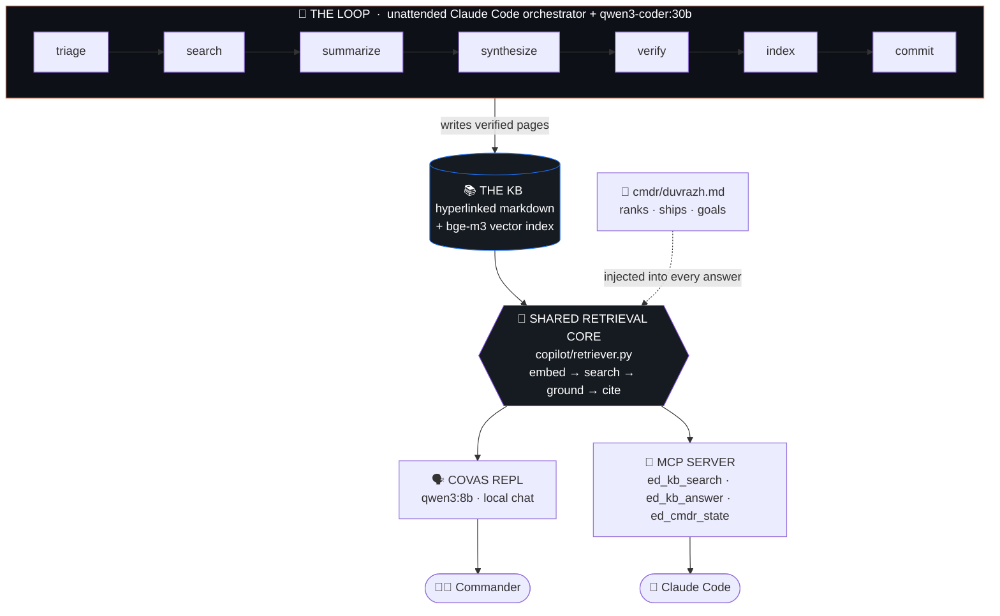
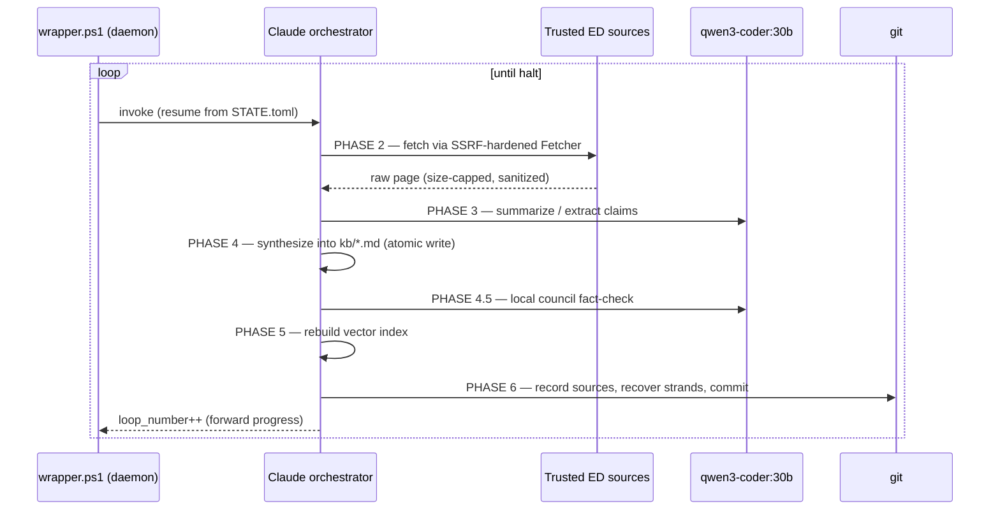

<div align="center">

# 🛰️ Elite Dangerous Knowledge Engine + COVAS

### An autonomous, self-verifying knowledge base for *Elite Dangerous* — and a local AI copilot that only ever tells you the truth.

*It researches the galaxy while you sleep, refuses to make things up, and was built — and stress-tested — by a [Starhold](https://starhold.dev/) AI multi-agent workflow.*

<br>


[](https://starhold.dev/)


</div>

---

> **The two ways an LLM lies to a *Elite Dangerous* commander:**
> it *hallucinates* a mechanic that never existed, or it *confidently repeats* one that was patched out three years ago.
> This system is engineered so it can do **neither**.

---

## ⚡ TL;DR

- 🤖 **An autonomous research daemon** crawls trusted ED sources, fact-checks what it finds, and commits hyperlinked knowledge-base pages — unattended, resumable, one git commit per loop.
- 🧠 **A local RAG copilot ("COVAS")** answers your questions grounded **only** in that verified KB, with citations — or says *"I don't have a verified source,"* which is a first-class, required answer.
- 🔒 **100% local inference** (Ollama: `qwen3`, `bge-m3`, `qwen3-vl`). Your commander data never leaves the machine.
- 🧪 **642 tests, eval Recall@5 = MRR = 1.000, zero false answers.** Every retrieval path is gated against hallucination.
- ⚖️ **Built by a [Starhold](https://starhold.dev/) AI multi-agent workflow.** Every non-trivial change was blind-generated by independent agents, adversarially verified, and only committed on a unanimous pass. The git log *is* the audit trail.

<div align="center">

`o7 Commander. The data is verified. Ask away.`

</div>

---

## 🎯 The problem this solves

*Elite Dangerous* community knowledge is a minefield of **stale and contradictory information** — pre-Odyssey loadouts, pre-Powerplay-2.0 strategy, and colonisation rumours, all presented as current truth. Point a chatty 8-billion-parameter model at it and you get **confident, fluent, wrong**.

Two failure modes, two defenses:

| Failure mode | Defense |
|---|---|
| 🌀 **Hallucination** — invents facts that were never true | **RAG grounding** — the copilot answers *only* from retrieved, verified KB chunks, with citations. No source → no answer. |
| 🪦 **Stale truth** — repeats mechanics that were patched out | **Current-truth-only KB** — obsolete-and-pointless mechanics are *omitted entirely*, not catalogued. The rare stale-but-relevant fact survives as a one-line `changed_note`. |

---

## 💬 How it answers — the grounding contract

COVAS doesn't *try* to be honest. It is *structurally incapable* of ungrounded confidence. Every answer is either **cited** or **refused**:

```text
CMDR › Where do I unlock Felicity Farseer, and what does she engineer?

COVAS › Felicity Farseer is unlocked at Farseer Inc in the Deciat system. She
        specializes in Frame Shift Drive, thrusters, and sensor modifications.
        Invitation requires 1 unit of Meta-Alloys. [deciat] [felicity-farseer]

        ▸ sources: kb/locations/deciat.md, kb/engineers/felicity-farseer.md
```

```text
CMDR › What's the optimal neutron-boosted route to Colonia using the Spansh plotter?

COVAS › I don't have a verified source for that in the knowledge base.
        (max retrieval similarity 0.41 < grounding floor τ=0.55 — refusing
        rather than guessing.)
```

That refusal is the feature. A high lexical match **can never** launder a false positive past the gate — grounding is always measured against the dense cosine similarity, never a keyword score.

---

## 🏛️ Architecture — three layers, one shared retrieval core



The retrieval logic is written **once** in `retriever.py` and consumed two ways — the local REPL *and* the MCP server — so there is **zero drift** between what `qwen3:8b` sees and what Claude sees. When the local model's answer isn't enough, you sleeve Claude Code onto the *identical* KB via MCP.

### Model assignment (all local, via Ollama @ `localhost:11434`)

| Model | Role |
|---|---|
| `qwen3-coder:30b` | Heavy synthesis & summarization inside the loop (strongest local reasoning) |
| `qwen3:8b` | The COVAS chat model — fast, fits VRAM with large context |
| `qwen3-vl:8b` | Vision — reads in-game screenshots you paste into structured profile facts |
| `bge-m3` | Embeddings for the KB vector index and query retrieval (1024-dim) |

---

## 🔁 The autonomous research loop

`wrapper.ps1` is an infinite daemon: it invokes a headless Claude Code orchestrator against a self-aware mega-prompt, with retry/backoff. The prompt knows the current `STATE.toml` and **resumes at the exact phase** it was killed on — `Ctrl-C` and relaunch is always safe.



| Phase | What happens | Hallucination / loss defense |
|---|---|---|
| **Triage** | Pick next targets from the queue | Dedup against `seen.json` (sha256-keyed) |
| **Search** | Fetch through the hardened `Fetcher` | SSRF chokepoint + polite throttle + size cap |
| **Summarize** | Extract claims (structured-first) | Sanitized before any LLM sees it |
| **Synthesize** | Merge into hyperlinked KB pages | Atomic write; conflicts marked, never silently resolved |
| **Verify** | Local Ollama mini-council fact-check | `verified:true` requires ≥2 agreeing sources |
| **Index** | Rebuild the bge-m3 vector index | Derived artifact; a committed page outranks it |
| **Commit** | Record sources, **recover strands**, `git commit` | Transaction-safe; state always advances (no livelock) |

> **Forward-progress contract:** a loop only counts if `STATE.toml`'s `loop_number` increases. Nothing on the live path is allowed to raise before that write — so the daemon can never deadlock itself, no matter what a fetch or a model does.

---

## 🛡️ Four layers against hallucination

This is the heart of the project. All four hold on **every** path — including multi-hop union and hybrid fusion.

1. **Empty-context refusal** — no retrieved chunks → no answer, full stop.
2. **Similarity floor (τ = 0.55)** — if the best chunk's dense cosine is below the floor, COVAS refuses instead of stretching.
3. **Forced citation** — every claim must carry a `[chunk-id]`; the prompt cannot emit an uncited fact.
4. **Claim-grounding check** — a cited claim must actually *share content* with the chunk it cites, so a confident-wrong answer with a real `[id]` stapled on is **rejected, not trusted**.

Grounding is **always** the dense cosine vs τ — never an RRF or BM25 rank. A keyword match cannot buy its way past the gate.

---

## 🔐 Security: the SSRF chokepoint

The loop fetches from the open web, so acquisition runs through a single, hardened gate — `copilot/ssrf.py` — that **refuses**:

- non-`http(s)` schemes, non-allowlisted hosts, blocked ports
- private / loopback / link-local / reserved IPs — **including** the cloud-metadata address `169.254.169.254`

…and it validates the **resolved IP**, re-checking **every redirect hop**. Fetched text is sanitized before any model or KB write; ingested chunks are never auto-`verified`. The allowlist (`edsm.net`, `spansh.co.uk`, `inara.cz`, `coriolis.io`, `raw.githubusercontent.com`, Canonn, the wiki, Frontier forums) is config-overridable; `allow_private`/`allow_any` default to `false` and are honored as `true` only when explicitly set.

---

## ⚖️ Built by a [Starhold](https://starhold.dev/) AI multi-agent workflow

This repo's real party trick: **it wasn't vibe-coded.** Every non-trivial change went through a **[Starhold](https://starhold.dev/) AI multi-agent workflow** — a verification architecture where correctness comes from *independence* and *grounding*, not from asking one model nicely:

```
Stage 0  ·  Spec          the arbiter scopes the task + acceptance criteria
Stage 1  ·  Blind gen     N agents solve it in isolated worktrees, never seeing each other
Stage 2  ·  Adversarial   one reviewer per failure-lens; NO verdict without an executable artifact
Stage 3  ·  Arbitration   commit only on a blind-unanimous pass — overrides are logged, never silent
```

<details>
<summary><b>📖 Case study: the F6 "stranded source" bug (click to expand)</b></summary>

<br>

A kill between *summarize* and *synthesize* could mark a URL "done" in `seen.json` while no page ever got written — a silently-lost fact. The fix had to be **active** (wired into the loop), **correct** (transaction-safe), and **non-bricking** (never able to deadlock the headless daemon).

- **Round 1** returned `merge_then_review`, not a commit: *both* candidate solutions carried a failure-recovery defect in the auto-recovery net — a queue-write failure could leave a URL `{absent-from-queue AND non-resumable}`, the exact strand it was meant to repair. The arbiter **refused to override it into a pass.**
- **Round 2** baked that defect in as a hard constraint with a required repro and landed a **clean blind-unanimous** fix: queue-append first → purge only after a confirmed append → no dead state possible, and the live path never raises.
- **A stabilization audit** then swept the whole changed surface and declared a **stable fixpoint** (0 blocker / 0 major).
- **A final Starhold run** added a self-guarding regression tripwire so a future loop can't silently re-introduce the bug class.

An arbiter declining to launder a plausible-but-wrong consensus — *that's* the workflow working. The full decision trail lives in the Starhold run ledger.

</details>

---

## 🚀 Quickstart

**Prerequisites:** Python 3.14, [Ollama](https://ollama.com) running locally, and Windows PowerShell (the daemon + launchers are PowerShell; the Python core is cross-platform).

```powershell
# 1. Clone
git clone https://github.com/Quadstronaut/EliteDangerousKB.git
cd EliteDangerousKB

# 2. Python env
python -m venv .venv
.\.venv\Scripts\python.exe -m pip install -r requirements.txt

# 3. Pull the local models
ollama pull qwen3:8b
ollama pull bge-m3
ollama pull qwen3-coder:30b   # only needed to run the research loop

# 4. Build the vector index from the shipped KB
.\.venv\Scripts\python.exe -c "from copilot import index; from copilot.paths import kb_dir; print(index.build_index(kb_dir()))"

# 5. Talk to your copilot
.\launch-copilot.ps1
```

**Grow the knowledge base yourself** (the autonomous loop):

```powershell
.\wrapper.ps1 -MaxLoops 3 -SkipPermissions   # bounded run; omit -MaxLoops to let it rip
```

Each loop researches trusted ED sources and commits a KB page. `STATE.toml` checkpoints every phase, so it resumes cleanly after any interruption.

---

## 🔌 Use it from Claude Code (MCP)

`.mcp.json` registers the server. In Claude Code, `/mcp` lists **ed-covas** with three tools:

| Tool | Returns |
|---|---|
| `ed_kb_search` | Ranked, cited KB chunks for a query |
| `ed_kb_answer` | A fully grounded answer (same gate as the REPL) |
| `ed_cmdr_state` | Your live commander profile (ranks, ships, goals) |

The launch path is **clone-anywhere portable** (`${CLAUDE_PROJECT_DIR}`) — it works from wherever you clone it.

---

## 🗺️ Project map

```
EliteDangerousKB/
├── copilot/                 # 28 modules · ~6.9k LOC — the Python brain
│   ├── retriever.py         #   shared retrieval core (REPL + MCP, zero drift)
│   ├── repl.py              #   COVAS interactive chat
│   ├── mcp_server.py        #   MCP tools for Claude Code
│   ├── index.py / chunker.py#   bge-m3 vector index + frontmatter-aware chunking
│   ├── sparse.py / fusion.py#   self-rolled BM25+ and RRF hybrid retrieval
│   ├── acquire.py / ssrf.py #   SSRF-hardened web acquisition
│   ├── verify.py            #   local mini-council fact-check
│   ├── loop_state.py        #   seen.json dedup + the F6 stranded-source guard
│   ├── commit_guard.py      #   transaction-safe strand recovery + discard marker
│   ├── atomic.py / locking.py#  atomic writes + cross-process locks
│   └── eval.py              #   RAG eval harness (recall@k, MRR, refusal calibration)
├── kb/                      # 20 verified, hyperlinked knowledge pages
├── summaries/  sources/     # the URL ledger + raw captures the KB was built from
├── ed-research-prompt.md    # the loop's brain (self-aware mega-prompt)
├── wrapper.ps1              # the autonomous daemon (retry/backoff)
├── launch-copilot.ps1       # user entry point — health-checks Ollama, opens the REPL
├── cmdr/duvrazh.md          # the commander profile injected into every answer
├── config.toml             # models, retrieval thresholds, acquisition allowlist
├── tests/                   # 50 files · 642 tests
└── docs/                    # design spec + implementation plans (A–D)
```

---

## 🧪 Quality

```powershell
.\.venv\Scripts\python.exe -m pytest -m "not integration" -q   # 642 passed
.\.venv\Scripts\python.exe -m copilot.eval                     # Recall@5 1.000 · MRR 1.000
```

- **642 tests passing**, 0 failed.
- **Eval: Recall@5 = 1.000, MRR = 1.000, 0 false refusals, 0 false answers** on the current corpus.
- A live integration gate exercises the real `bge-m3` + `qwen3:8b` stack: grounded queries cite; off-topic queries refuse.
- Tests are written to be **revert-sensitive** — they go red when the fix they guard is removed, not just when the code crashes.

---

## 📊 Current state (honest)

| Subsystem | State |
|---|---|
| Foundation + COVAS core | ✅ built — working end-to-end |
| Data-first profile (journal / game-state / screenshot ingest) | ✅ built |
| MCP server (`ed_kb_search` / `ed_kb_answer` / `ed_cmdr_state`) | ✅ built |
| Autonomous research loop | ✅ built + ran live |
| Hybrid retrieval (BM25 + dense RRF) | ✅ built — default `dense` (RRF flips on once the KB outgrows it) |
| Local verification (mini-council) | ✅ built — cloud escalation is manual |
| SSRF-hardened web acquisition | ✅ built |
| F6 strand guard + self-guarding tripwire | ✅ built — Starhold-hardened |
| Multi-hop synthesis | 🟡 scaffolded, deferred behind a flag until eval justifies it |
| Journal-watcher live mode | 🔜 v1.1 |

> The KB ships at **20 pages** by design — *current truth only*. It grows when you run the loop, not by hoarding obsolete lore.

---

## 🧰 Tech stack

**Python 3.14** · **Ollama** (qwen3:8b / qwen3-coder:30b / qwen3-vl:8b / bge-m3) · **Model Context Protocol** · **PowerShell** daemon & launchers · **pytest** · **git** as the KB's transaction log. Deliberately lean — self-rolled BM25, no heavyweight vector database, minimal dependencies.

---

## ⚠️ Disclaimer & License

Licensed **MIT** — see [`LICENSE`](./LICENSE).

*Elite Dangerous* is a trademark of **Frontier Developments plc**. This is an **unofficial, non-commercial fan project**, not affiliated with or endorsed by Frontier. In-game facts in the KB are derived from community sources (EDSM, Coriolis, INARA, Canonn, the ED wiki) and Frontier's own data, and remain the property of their respective owners.

<div align="center">
<br>

**Fly safe, Commander.** `o7`

<sub>Built by <a href="https://starhold.dev/">Starhold</a> 🛠️ AI multi-agent workflows · verified by independent agents · grounded in nothing but the truth</sub>

</div>
